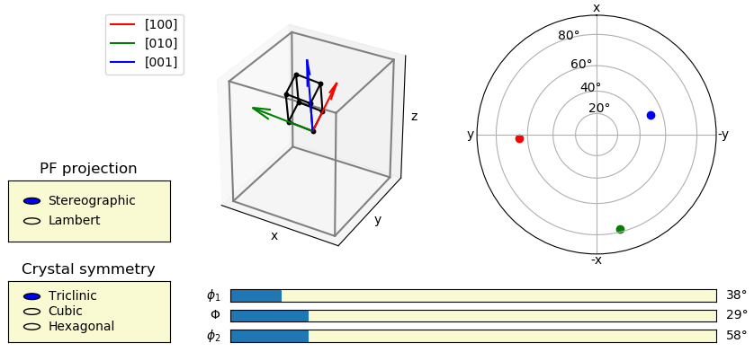

# CrystalEuler
Interactive representation of Euler angles for crystallography

## Synopsis
The small code helps to illustrate the Euler angles used in crystallography. It displays a lattice in a reference frame (usually given by the sample) with respect to the Bunge Euler angles and the corresponding pole figure. 

This code was initially developed for educational purpose.

## How to use
Simply run ``3D_Euler.py`` in Python, and the interactive plot will open. It illustrates the subsequents Euler rotations used for representing the orientation of a crystal. Then, you can play around with some options, such as the crystal symmetry.

The projection used for pole figure can be set to stereographic (default) or Lambert (sometimes called equal-area).

## Spyder users
If you use Spyder, you should configure it so that figures open in seperate windows. See [here](https://geo-python.github.io/2017/lessons/L7/matplotlib.html#spyder-plots-in-separate-windows) for details.
